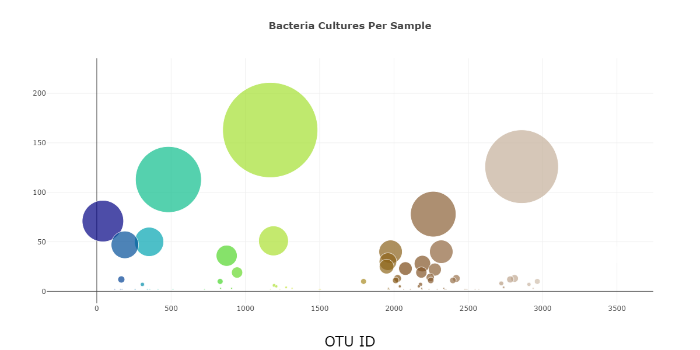

# Belly Button Biodiversity

## 1 Purpose

Roza had a partially completed a dashboard that she needs to visualize the bacterial data for each volunteer in this project. The purpose of the project is to assist Improbable Beef in identifying a species of bacteria as a possible candidate to manufacture synthetic beef.  We were tasked with completing the Belly Button Biodiversity Dashboard that Roza has prepared so that volunteers will be able to identify whether that species is found in their navel.  The  completed dashboard contains the panel for demographic information that Roza provided and also now provides visualization of the bacterial data for each volunteer. Specifically, volunteers can now identify the top 10 bacterial species in their belly buttons. If Improbable Beef identifies a species as a candidate to manufacture synthetic beef, volunteers will be able to identify whether that species is found in their navel.

## 2 Results

The Belly Button Biodiversity Dashboard, shown in figure 1 below, was captured from the GitHub Page:

https://gregorybwilson.github.io/Plotly_Deployment/

When the dashboard is first opened in a browser, ID 940’s data is displayed and all three charts work according to the requirements.  When another sample is selected from the dropdown menu, the webpage loads, the bar, bubble and gauge charts initialize and are update to the new samples data.

***Figure 1 - Customized Belly Button Biodiversity Dashboard***

### 2.1 Customized Belly Button Biodiversity Dashboard

The dashboard has been customized in the following ways:
- An image has been added to the jumbotron. 
- Customization of fonts have been added throughout the website including:
  - Modification of the panel text
  - Modification of the bar chart title
  - Modification of the bubble chart title
- More information about the project has been to the page which also changed the layout by adding an overview section just under the jumbotron
- Each graph now has a descriptive section either above or below it to explain the graphics

A description of each graph can be found in the following sections.

### 2.2 Top 10 Bacteria Cultures Found

The data displayed on the dashboard has been read in from a JSON file samples.json.  

A JavaScript file plots.js was written that:

-  Creates an array when a sample is selected from the dropdown menu

- Creates a trace object in the function buildCharts() that contains the following:

  - Y values that are the otu_ids sorted in descending order
  - X values that are the sample_values also in descending order
  - The hover text been been assigned as the otu_labels, again in in descending order.
- Creates the layout array in the buildCharts function that creates a title for the chart , I also added bold font the the title
- When the dashboard first opens in a browser, ID 940’s data is displayed and the bar chart has the following: 

  - The top 10 sample_values are sorted and displayed in descending order
  - With the top 10 sample_values as values, and
  - The otu_ids as the labels

The horizontal bar chart for ID 940’s data is shown below if figure 2.

***Figure 2 - Horizontal Bar Chart***

### 2.3 Bacteria Cultures Per Sample

Figure 3 below is a bubble chart representation of the data for ID 940’s data.

***Figure 3 - Bubble Chart***

The code for this trace object in the buildCharts() function does the following:

- Sets the otu_ids as the x-axis values
- Sets the sample_values as the y-axis values
- Sets the otu_labels as the hover-text values
- Sets the sample_values as the marker size
- Sets the otu_ids as the marker colors

The code for the layout in the in the buildCharts() function does the following:

- Creates a title, which I have also modified by bolding the font
- Creates a label OTU ID for the x-axis
- The text for a bubble is shown when hovered over

When the dashboard is first opened in a browser, ID 940’s data is displayed in the dashboard. 

### 2.4 Belly Button Washing Frequency

***Figure 4 - Gauge Chart***

The code to build the gauge chart in figure 4 above does the following:

- Creates a title for the chart which was formatted using HTML code
- Creates the ranges for the gauge in increments of two, with a different color for each increment, I have also inserted a "Threshold" marker at wfreq = 5, which I felt might be a recommended number.
- The washing frequency value is shown on the gauge chart.
- The indicator also shows the level for the washing frequency on the gauge.

As with the bar and bubble chart the gauge chart is working according to the requirements and displays the corresponding wfreq data.

### 3 Summary

All three charts are working according to their requirements when a sample is selected from the dropdown menu.  When the webpage loads, the bar, bubble chart and gauge charts initialize without error showing data for the first sample and update correctly when a new sample is selected.  The dashboard has been updated with formatting and images to improve its appearances and lots of text has been added to help users understand the purpose and operation of the website. I am optimistic that Roza and her volunteers will be very happy with their new dashboard and that Improbable Beef will be successful in their quest to create synthetic beef from bacteria.
